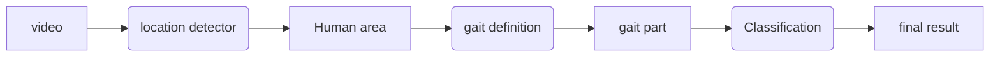
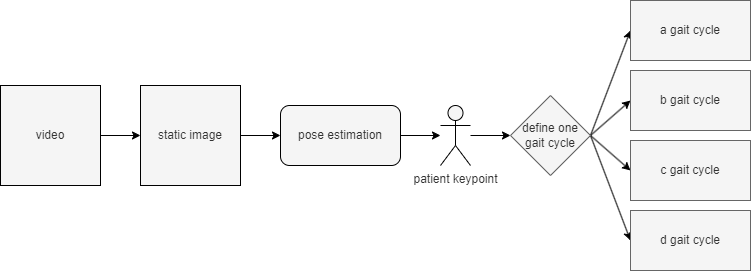

<div align="center">    
 
# Skeleton Video based Action Recognition for Adult Spinal Deformity Classification
  
<!--
ARXIV   
[](https://www.nature.com/articles/nature14539)
-->
<!--  -->

<!--  
Conference   
-->
</div>
 


## Description

The main contribute of this project is:

1. use pose estimation to define the gait cycle for different person.
2. split the gait cycle into several parts.
3. use the splitted gait cycle to train the model.
4. use the trained model to classify the disease.
5. test with the different gait cycle part.

The classification label is:

- ASD
- DHS
- HipOA + LCS
- Normal

The reason why I combine the HipOA with LCS has two point,

1. data is not enough.
2. the HipOA and LCS are similar in the medical expression.

## How to define One Gait Cycle

Define the **One Gait Cycle** is a key point in this study.
A simple but effective way is to use the **pose estimation**.
For example, use one certain keypoint (left foot, etc.) to define the gait cycle.



To estimate the keypoint, we try to use some different method to predict the keypoint.

1. YOLOv8 pose estimation
2. mediapipe pose estimation
3. openpose

But, there also have some problem in this method.

## Abliation Study for different view

When record the video, we can use different view to record the video.
In this dataset, it includes two different view.

- left view
- right view

Here we try to use the different view to train the model, with several gait parts.
<!-- 
## Citation

```
@article{YourName,
  title={Your Title},
  author={Your team},
  journal={Location},
  year={Year}
}
``` -->
