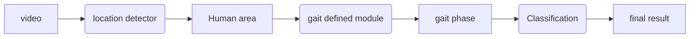
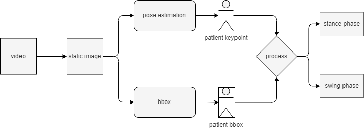

<div align="center">    
 
# PhaseMix: A Periodic Motion Fusion Method for Adult Spinal Deformity Classification
  
<!--
ARXIV   
[](https://www.nature.com/articles/nature14539)
-->
<!--  -->

<!--  
Conference   
-->
</div>
 


## Description

We present a method that can effectively **capture cycle** and **action symmetry** information in motion and exploit the characteristics of gait motion.
Our experiments, performed on a video dataset consisting of 81 different patients, showed that our method outperformed baseline approaches. 
The proposed method achieved an accuracy of 71.43, a precision of 72.80, and an F1 score of 71.15.

The contributions of this study are as follows:

1. We propose a method for image-level fusion. The method considers periodicity in periodic motion and symmetry features in action.
2. We propose a video-based method for detecting the walking phase to accurately perform feature fusion.
3. We conducted a comparative analysis of predictions generated by the proposed method using different backbone architectures. This analysis aimed to demonstrate the importance of periodicity and symmetry in periodic motion in model detection.

The classification label is:

- ASD
- DHS
- HipOA + LCS

## Gait Defined Model

Define **One Gait Cycle** is a key point in this study.
A simple but effective way is to use the **pose estimation**.
For example, use one certain keypoint (left foot, etc.) to define the gait cycle.



We use the **YOLOv8** to get the bounding box of the human area, and use the **pose estimation** to get the keypoint of the human area.
After that, we can define the gait cycle based on them.
You can find the code in the `./prepare_gait_cycle_index` folder.

We compare the results of the proposed method with the results of some human action recognition models.
1. CNN 
2. CNN LSTM 
3. Two-stream CNN
4. Skeleton-based model (STGCN)
5. 3D CNN 

## Abliation Study 

We prepared two different ablation experiments as follows.
1. first ablation study
- We removed the periodic motion fusion module and compared the results.
- We removed the symmetry feature fusion module and compared the results.

2. second ablation study
We use same backbone architecture with different training strategy.

## Docker  

We recommend using docker to build the training environment.

1. pull the official docker image, where release in the [pytorchlightning/pytorch_lightning](https://hub.docker.com/r/pytorchlightning/pytorch_lightning)

``` bash  
docker pull pytorchlightning/pytorch_lightning
```

2. create container.

``` bach  
docker run -itd -v $(pwd)/path:/path --gpus all --name container_name --shm-size 32g --ipc="host" <images:latest> bash 

```

3. enter the container and run the code.

``` bash  
docker exec -it container_name bash
```

<!-- 
## Citation

```
@article{YourName,
  title={Your Title},
  author={Your team},
  journal={Location},
  year={Year}
}
``` -->
